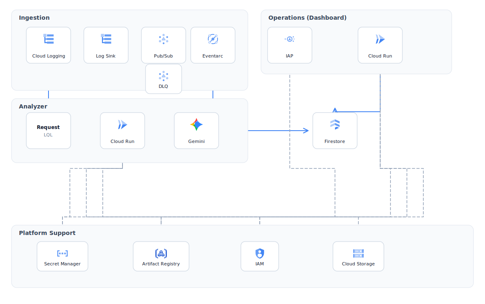

# Loggy AI

> GCP-native, Gemini-powered intelligent error analysis AIOps platform

## Overview

Production log noise is easy to collect and hard to triage. **Loggy AI** is a GCP-native AIOps (AI for IT operations) platform that turns Cloud Logging streams into structured incident intelligence—root cause, business impact, and remediation plans—via Gemini, then surfaces those reports in an operations dashboard.

It is built as two core modules: an **Analyzer** that can run on demand or as an always-on event pipeline, and a **Dashboard** that gives SREs and platform engineers a clear view of what the system already figured out.

For setup, local development, and deployment steps, see [SETUP.md](SETUP.md).

## Core Modules

### Analyzer

The Analyzer is a FastAPI analysis engine that ingests Cloud Logging payloads, redacts sensitive fields, applies prompt safety checks, and calls Gemini with structured output schemas to produce incident reports (operational summary, service, business impact, root cause, suggestions, and action plans).

It supports **two run modes** from the same engine:

| Mode              | How it runs                                                                                                                               | Scope                                                                                                                                                  |
| ----------------- | ----------------------------------------------------------------------------------------------------------------------------------------- | ------------------------------------------------------------------------------------------------------------------------------------------------------ |
| **Request-based** | Caller submits a Logging Query Language (LQL) / filter configuration; the Analyzer fetches matching logs and analyzes them **on the fly** | Any log selection expressible in LQL—not limited to ERROR—so operators can investigate warnings, audit trails, or custom windows interactively         |
| **Event-based**   | Automatically triggered by Eventarc from a Logging → Pub/Sub ERROR sink                                                                   | Always-on AIOps path with signature-based deduplication, idempotent processing, a dead-letter queue (DLQ), and Firestore persistence for the Dashboard |

### Dashboard

The Dashboard is an Identity-Aware Proxy (IAP)–protected React + Express Cloud Run app that reads persisted incident reports from Firestore. It provides KPI overviews, impact visualization, filtering, and report detail with remediation plans—closing the loop from automated analysis to operator UX.

## Highlights

**AI platform**

- Signature-based claim/dedup so concurrent identical errors share one Gemini call instead of burning N inferences
- Structured Gemini outputs as typed contracts (incidents, impact levels, action plans)—not free-form chat
- PII/secret redaction and dual prompt guardrails before model input
- Retry-friendly failure semantics on the event path (claim release, pending retries)

**Cloud & delivery**

- Event-driven ERROR pipeline with DLQ and sink self-exclusion to avoid feedback loops
- Least-privilege runtime identity, Secret Manager for API keys, IAP on the Dashboard
- Infrastructure as Code with Terraform; gated CI/CD (tests → Terraform → Cloud Run) using Workload Identity Federation (WIF)

**Software architecture**

- Clear module boundary: Analyzer (orchestration + intelligence) vs Dashboard (operator experience)
- Dual run modes on one Analyzer: interactive LQL investigation and autonomous Eventarc pipeline
- Adapter-oriented boundaries between cloud ingest, AI analysis, and the API surface

## Features

- **On-demand analysis** — LQL/filter-driven requests return structured incident intelligence without requiring an ERROR-only sink
- **Autonomous ERROR triage** — Eventarc-driven path analyzes production ERROR events as they arrive
- **Incident intelligence** — Consolidated incidents with business impact scoring and step-by-step action plans
- **Cost-aware concurrency control** — Signature claiming so duplicate error shapes do not re-invoke Gemini under load
- **Idempotent event processing** — Duplicate deliveries are safe; failed work can retry without double-spending inference
- **Safety controls** — Field pruning, payload limits, redaction, and layered prompt validation
- **Ops dashboard** — Open-report KPIs, impact chart, severity/service filters, and full report detail
- **Platform footprint** — Pub/Sub, Eventarc, Firestore, Artifact Registry, Cloud Run, and IAM declared in Terraform

## Architecture

- **Request path:** Cloud Logging queried via LQL/filters → Analyzer → Gemini → structured analysis returned to the caller (on the fly; any matching log scope).
- **Event path:** ERROR sink → Pub/Sub → Eventarc → Analyzer → Gemini → Firestore reports; undeliverable messages land in the DLQ after retries.
- **Dashboard path:** IAP → Dashboard Cloud Run service → Firestore (read path for operators).
- **Platform support:** Secret Manager (Gemini credentials), Artifact Registry (container images), IAM (service access), Cloud Storage (Terraform remote state).

## Design Decisions

1. **Dual Analyzer modes** — One engine for on-demand LQL and autonomous Eventarc pipelines; shared prompts, schemas, and guardrails.
2. **Signature claim over per-event inference** — Concurrent identical errors share one Gemini call; followers update counts or retry while pending.
3. **Safety before the model** — Redaction, payload caps, and layered prompt validation before inference.
4. **LLM as a downstream service** — Idempotency, DLQ, and explicit retry semantics—not fire-and-forget calls.
5. **Adapter boundaries** — Decouple cloud ingest and GenAI from the API; GCP shipped, interfaces allow extension.

## Tech Stack

| Layer            | Choices                                                |
| ---------------- | ------------------------------------------------------ |
| Analyzer         | Python 3.13+, FastAPI, Pydantic, Google GenAI (Gemini) |
| Dashboard        | React, Vite, Express, D3                               |
| Data & messaging | Cloud Logging, Pub/Sub, Eventarc, Firestore            |
| Compute & access | Cloud Run, IAM, IAP, Secret Manager, Artifact Registry |
| Delivery         | Docker, Terraform, GitHub Actions, WIF                 |
